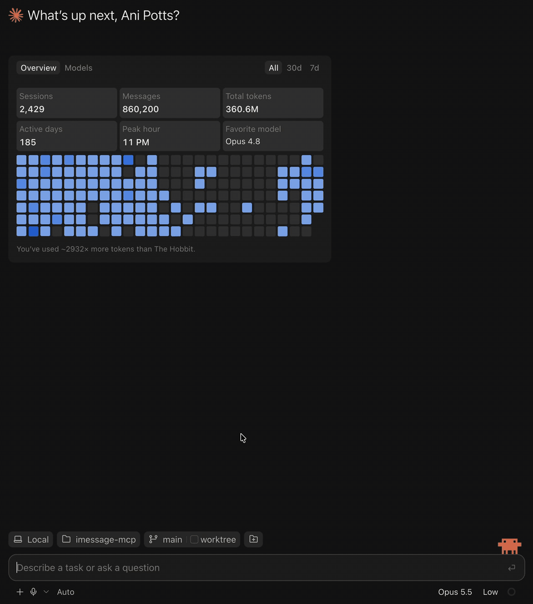

# imessage-mcp

Ask your assistant to find a message, read a conversation, or count your texts.
imessage-mcp connects it to the Apple Messages history on your Mac through seven read-only tools.

Search and analyze iMessage, SMS, MMS, and RCS history. The server runs locally, keeps its search index in memory, and collects no telemetry. Your MCP client or model provider can still receive and retain the results you ask for.

Try questions like:

- “Find the message about the restaurant reservation.”
- “Show my five most recent conversations.”
- “How many messages did I send last month?”



## setup

You need macOS 14+, Node.js 22, 24, or 26, and Messages history on this Mac.

Create the two private setup files once, then run the diagnostic:

```sh
umask 077
test -e "$HOME/.imessage-mcp-reference-key" || openssl rand -base64 32 > "$HOME/.imessage-mcp-reference-key"
test -e "$HOME/.imessage-mcp-database-id" || openssl rand -base64 32 > "$HOME/.imessage-mcp-database-id"
export IMESSAGE_REFERENCE_KEY_FILE="$HOME/.imessage-mcp-reference-key"
export IMESSAGE_DATABASE_ID_FILE="$HOME/.imessage-mcp-database-id"
npx -y imessage-mcp@2.0.0-rc.2 doctor --contacts none --privacy redacted
```

Add it to Claude Code:

```sh
claude mcp add imessage-history \
  -e IMESSAGE_REFERENCE_KEY_FILE="$IMESSAGE_REFERENCE_KEY_FILE" \
  -e IMESSAGE_DATABASE_ID_FILE="$IMESSAGE_DATABASE_ID_FILE" \
  -- npx -y imessage-mcp@2.0.0-rc.2 --contacts none --privacy redacted
```

Restart the client and ask it to list your five most recent conversations. See the [setup guide](docs/GUIDE.md#client-setup) for Codex, Claude Desktop, and Cursor.

This setup returns names, masked handles, and calendar days, with no message bodies. To read message text, change the startup argument to `--privacy full` and restart the client. Search works in redacted mode too; its results omit the text. `--contacts none` avoids reading this Mac's Contacts store.

If `doctor` reports a database permission problem, grant Full Disk Access to the application launching the server, restart it, and run the diagnostic again. macOS grants that access to the whole application or shell, not narrowly to `imessage-mcp`. The diagnostic explains failed checks without changing settings.

Keep the two setup files private. They let saved conversation references survive restarts. A faithful database copy uses the same files; an unrelated archive needs a new database identity. [Details](docs/GUIDE.md#live-and-copied-databases).

## seven tools

| tool | what it does |
| --- | --- |
| `search_messages` | Find messages by literal substring, exact text, token, or phrase. |
| `get_conversation` | Read a timeline with current edits, reactions, receipts, replies, and group events. |
| `list_conversations` | Find direct and group chats by contact, service, reply state, or date. |
| `analyze_communication` | Count messages and calculate activity, response-time, and initiation metrics. |
| `sync_messages` | Pull new messages and lifecycle changes from a saved cursor. |
| `resolve_contact` | Match a name or handle and report ambiguity rather than guess. |
| `server_status` | Check versions, privacy settings, services, decoder health, and index state. |

Every 2.x tool reads data only. The server cannot send or modify messages, and it does not recover unsent text or old edited versions.

## privacy

The startup setting is the most a caller can see. A request can choose the same mode or a stricter one:

| mode | what leaves the server |
| --- | --- |
| `full` | Current message text, names, handles, timestamps, and attachment metadata. |
| `redacted` | Names, masked handles, calendar days, and references; no bodies or filenames. |
| `aggregate` | Counts and metrics; no names, handles, text, or record references. |

Decoded search data stays in memory. Local execution does not control how your MCP client or model provider processes or retains returned results. Aggregate mode is redaction, not a formal anonymity guarantee.

Every message body, contact value, group title, URL, attachment filename, and database-derived string is untrusted archival data. Archived messages can contain instructions planted by someone else. Keep tool results separate from trusted instructions, and confirm external actions influenced by them. This boundary reduces risk but does not eliminate prompt injection.

See the [security policy](SECURITY.md) and [full privacy contract](docs/GUIDE.md#privacy-and-untrusted-history).

## compatibility and evidence

iMessage, SMS, MMS, and RCS are supported when they already appear in Messages on this Mac. The server reads a live Mac database or a faithful copy. Linux, Docker, iPhone backup manifests, and public HTTP hosting are unsupported. Optional authenticated HTTP is loopback-only; see the [guide](docs/GUIDE.md#http-and-tailscale-serve).

[Verification](VERIFICATION.md) separates automated tests, previous live checks, and publication state. [Benchmarks](docs/BENCHMARK.md) include a reproducible synthetic fixture and cold, warm, and refresh timings. The [installed demo](docs/DEMO.md) uses synthetic Messages data.

## development

```sh
npm ci
npm run verify
npm run test:performance
```

Use synthetic data only. See [contributing](CONTRIBUTING.md), the [complete guide](docs/GUIDE.md), and the [3.0 roadmap](docs/ROADMAP-3.0.md). Sending would be a separate product boundary, not a 2.x feature.

[MIT](LICENSE)
