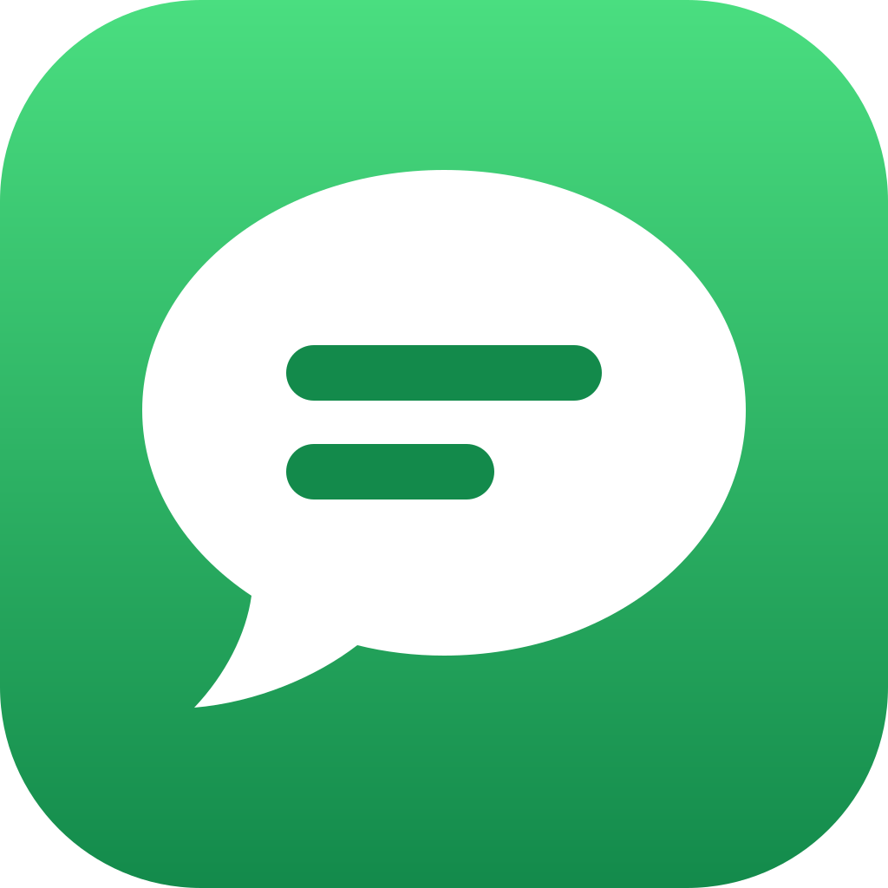

# imessage-mcp

[](https://www.npmjs.com/package/imessage-mcp) [](https://registry.modelcontextprotocol.io/v0/servers?search=imessage-mcp) [](https://github.com/anipotts/imessage-mcp/actions/workflows/ci.yml) [](LICENSE)

Search and read your Messages history from Claude, Codex, Cursor, VS Code, and any other MCP client.


Read-only. Runs on your Mac. No accounts, no cloud service, nothing to compile.

- Finds messages by words, exact text, or phrase across iMessage, SMS, MMS, and RCS
- Reads whole conversations with edits, unsent messages, reactions, replies, and read receipts
- Shows photos people sent you, with location data removed
- Keeps up with new messages through a change feed, and answers counts and response-time questions

## Install

**Requirements:** macOS 14 or newer. Node.js 24.16 or newer for `npx` installs (Claude Desktop brings its own).

Standard config, for any client that reads `mcpServers` JSON:

```json
{
  "mcpServers": {
    "imessage": {
      "command": "npx",
      "args": ["-y", "imessage-mcp@latest"]
    }
  }
}
```

Then give the app that runs it **Full Disk Access**: System Settings > Privacy & Security > Full Disk Access, turn on the app (Claude, your terminal, Cursor, VS Code, ...), then quit it fully and reopen it. Not sure which app? Run `npx -y imessage-mcp@latest doctor` from that app's terminal and it tells you. Until access is granted, every tool answers with these same steps.

<details>
<summary>Amp</summary>

```bash
amp mcp add imessage -- npx -y imessage-mcp@latest
```

</details>

<details>
<summary>Claude Code</summary>

```bash
claude mcp add --scope user imessage -- npx -y imessage-mcp@latest
```

Or install the plugin: `/plugin marketplace add anipotts/imessage-mcp`, then `/plugin install imessage-mcp@anipotts`.

</details>

<details>
<summary>Claude Desktop</summary>

Download [imessage-mcp.mcpb](https://github.com/anipotts/imessage-mcp/releases/latest/download/imessage-mcp.mcpb) and double-click it, or install **iMessage History** from Settings > Extensions if it is listed there. To update a bundle you installed yourself, download the newest one and double-click it again.

Then turn on Claude in Full Disk Access and quit and reopen Claude.

</details>

<details>
<summary>Cline</summary>

Add the standard config to `cline_mcp_settings.json` ([docs](https://docs.cline.bot/mcp/configuring-mcp-servers)).

</details>

<details>
<summary>Codex</summary>

```bash
codex mcp add imessage -- npx -y imessage-mcp@latest
```

Or in `~/.codex/config.toml`:

```toml
[mcp_servers.imessage]
command = "npx"
args = ["-y", "imessage-mcp@latest"]
```

</details>

<details>
<summary>Copilot CLI</summary>

Run `/mcp add`, or add the standard config to `~/.copilot/mcp-config.json` with `"type": "local"`.

</details>

<details>
<summary>Cursor</summary>

[](https://cursor.com/en/install-mcp?name=imessage&config=eyJjb21tYW5kIjoibnB4IiwiYXJncyI6WyIteSIsImltZXNzYWdlLW1jcEBsYXRlc3QiXX0%3D)

Or add the standard config to `~/.cursor/mcp.json`.

</details>

<details>
<summary>Gemini CLI</summary>

Add the standard config to `~/.gemini/settings.json`.

</details>

<details>
<summary>Goose</summary>

[](https://block.github.io/goose/extension?cmd=npx&arg=-y&arg=imessage-mcp%40latest&id=imessage&name=iMessage&description=Search%20and%20read%20your%20Apple%20Messages%20history)

</details>

<details>
<summary>JetBrains (Junie)</summary>

Add the standard config to `.junie/mcp/mcp.json`, or type `/mcp` in Junie CLI.

</details>

<details>
<summary>Kiro</summary>

[](https://kiro.dev/launch/mcp/add?name=imessage&config=%7B%22command%22%3A%22npx%22%2C%22args%22%3A%5B%22-y%22%2C%22imessage-mcp%40latest%22%5D%7D)

</details>

<details>
<summary>opencode</summary>

In `~/.config/opencode/opencode.json`:

```json
{
  "$schema": "https://opencode.ai/config.json",
  "mcp": {
    "imessage": { "type": "local", "command": ["npx", "-y", "imessage-mcp@latest"], "enabled": true }
  }
}
```

</details>

<details>
<summary>VS Code</summary>

[](https://insiders.vscode.dev/redirect?url=vscode%3Amcp%2Finstall%3F%257B%2522name%2522%253A%2522imessage%2522%252C%2522command%2522%253A%2522npx%2522%252C%2522args%2522%253A%255B%2522-y%2522%252C%2522imessage-mcp%2540latest%2522%255D%257D) [](https://insiders.vscode.dev/redirect?url=vscode-insiders%3Amcp%2Finstall%3F%257B%2522name%2522%253A%2522imessage%2522%252C%2522command%2522%253A%2522npx%2522%252C%2522args%2522%253A%255B%2522-y%2522%252C%2522imessage-mcp%2540latest%2522%255D%257D)

```bash
code --add-mcp '{"name":"imessage","command":"npx","args":["-y","imessage-mcp@latest"]}'
```

</details>

<details>
<summary>Warp, Windsurf, Zed, and others</summary>

Add the standard config in the client's MCP settings. Zed uses `context_servers` with `"source": "custom"`.

</details>

If a GUI app reports that `npx` was not found, it cannot see your Node installation: use the full path from `which npx` as the `command`.

## Use it

Ask in plain words: "catch me up on my texts", "find the message about the dinner reservation", "how fast does Sam usually reply?". Three prompts are also in your client's prompt menu:

| prompt | what it does |
| --- | --- |
| `catch_up` | Who is waiting on a reply from you, and what they need |
| `draft_reply` | A reply in your own texting style. You send it; this server cannot. |
| `recap` | Your week in messages: volume, busiest conversations, anyone still waiting |

Clients that attach resources can use `imessage://conversations` and `imessage://conversations/{chat_id}`.

## Tools

| tool | what it does |
| --- | --- |
| `search_messages` | Search by substring, exact text, token, or phrase, in message text, conversation names, or attachment names |
| `get_conversation` | Read a conversation by `chat_id` or by a contact or group name, with edits, reactions, receipts, replies, and attachments |
| `list_conversations` | Find conversations by contact, service, kind, reply state, or date, each with its latest message, newest first or by who you text most |
| `get_attachment` | Show one attachment: images as a JPEG with metadata removed, text files as text |
| `sync_messages` | Pull every change since a cursor: new, edited, unsent, and deleted messages, reactions, and receipts |
| `analyze_communication` | Message counts by hour and weekday, response times, streaks, and who starts conversations |
| `resolve_contact` | Match a name, phone number, or email to a contact, and report ambiguity rather than guess |
| `server_status` | Version, update availability, access, index state, and schema support |

Every tool is read-only and marked `readOnlyHint`. Results use plain ids (`message_id`, `chat_id`, `attachment_id`) you can pass between tools.

## Configuration

Add options to `args`, for example `["-y", "imessage-mcp@latest", "--privacy", "redacted"]`.

| option | description |
| --- | --- |
| `--privacy <mode>` | The most any caller can see. `full` (default), `redacted` (names and masked handles, calendar days, no message text or filenames), or `aggregate` (counts only). A call can ask for a stricter mode, never a looser one. *env* `IMESSAGE_PRIVACY` |
| `--contacts <mode>` | `live` (default) names handles from your Contacts; `none` shows handles only. *env* `IMESSAGE_CONTACTS` |
| `--database <path>` | Read a copy of `chat.db` instead of this Mac's Messages. *env* `IMESSAGE_DB` |
| `--transport http --port <n>` | Serve MCP over HTTP on 127.0.0.1 instead of stdio. Requires `IMESSAGE_API_TOKEN` or `IMESSAGE_API_TOKEN_FILE`. `IMESSAGE_ALLOWED_HOSTS` and `IMESSAGE_ALLOWED_ORIGINS` take comma-separated lists; both default to localhost. |
| `IMESSAGE_CACHE=0` | Keep the search index in memory only |
| `IMESSAGE_WARM_SEARCH=0` | Build the search index on the first search instead of at startup |
| `IMESSAGE_UPDATE_CHECK=0` | Turn off the version check |

## Privacy and security

- **Read-only.** The server opens the Messages database read-only and has no tool that sends, edits, reacts, or marks anything read.
- **Local.** No accounts, telemetry, or analytics. The only network request is an optional version check to the npm registry.
- **Your client sees what you ask for.** Results go to the MCP client you use and its model provider, under their policies. `--privacy redacted` or `aggregate` limits what leaves the server.
- **Search index.** Built on your Mac and cached encrypted in `~/Library/Caches/imessage-mcp`, with a key derived from your Messages database, so it opens only for an app that can already read your messages. Deleting it is always safe.
- **Untrusted content.** Messages can contain text written to manipulate an AI. The server tells clients to treat all message content as data, never as instructions.

Details: [SECURITY.md](SECURITY.md) and [PRIVACY.md](PRIVACY.md).

## Development

```bash
npm ci
npm test      # unit tests on synthetic Messages databases
npm run e2e   # launches the built server over stdio and HTTP
npm run perf  # one-million-message performance gates
```

Tests use synthetic data only. See [CONTRIBUTING.md](CONTRIBUTING.md).

## License

MIT
